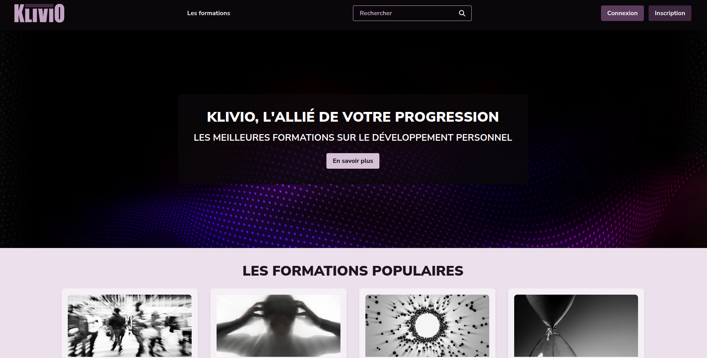
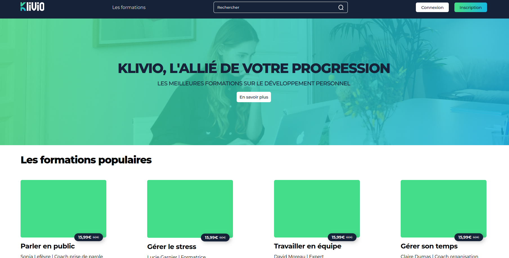

# Integration Page d’Accueil — HTML/CSS & Tailwind CSS

Ce projet consiste en l'intégration fidèle d'une **page d'accueil** déclinée en deux versions techniques. L'objectif était de parfaire la maîtrise des structures HTML, de la mise en page moderne (Flexbox/Grid) et du responsive design.

---

## 🔗 Démos (GitHub Pages)

* **Version HTML/CSS Pur** : [Consulter la démo](https://jujeh-beep-boop.github.io/integration_page_accueil/html-css)
* **Version Tailwind CSS** : [Consulter la démo](https://jujeh-beep-boop.github.io/integration_page_accueil/tailwind/)

---

## 📸 Aperçu

---

## 🛠️ Objectifs pédagogiques

* **Structure sémantique** : Utilisation des balises HTML5 appropriées pour le SEO et l'accessibilité.
* **Responsive Design** : Adaptation de la maquette sur mobile, tablette et desktop.
* **Tailwind CSS** : Utilisation des classes utilitaires pour un développement rapide et maintenable.
* **Pixel Perfect** : Respect rigoureux des espacements et des contraintes visuelles de la maquette originale.

---

## 📂 Structure du projet

* `html-css/` : Version réalisée en CSS standard.
* `tailwind/` : Version réalisée avec le framework Tailwind.
* `tailwind/images/` : Ressources médias et captures d'écran.

---

## 💻 Technologies utilisées

* **HTML5**
* **CSS3** (Flexbox, Grid, Variables)
* **Tailwind CSS**
